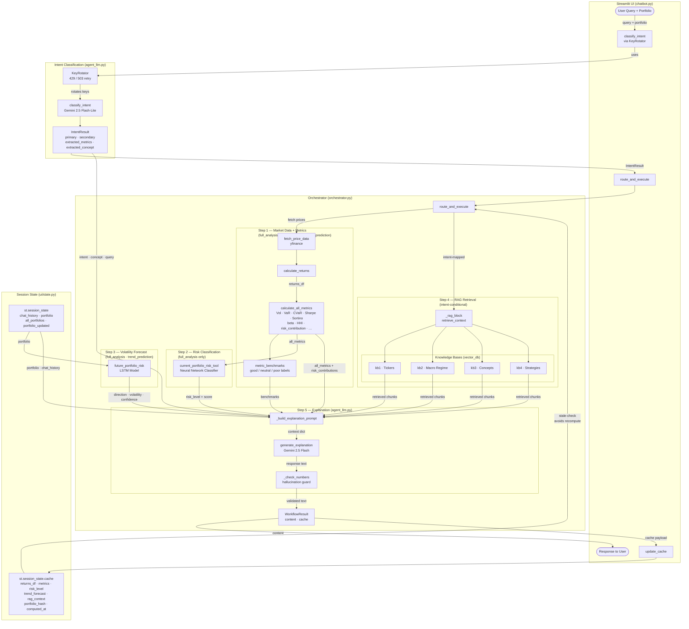

# dsa4265-group-5-Portfolio-Risk-Analyst-Chatbot
Portfolio Risk Analyst Chatbot using AI agent and various tools!

**Live demo:** [portfolio-risk-analyst-chatbot.streamlit.app](https://portfolio-risk-analyst-chatbot.streamlit.app/)

## Features

A conversational agent that analyses an investment portfolio. It classifies each query into one of six intents and routes it through the relevant tools:

- **Full analysis** — end-to-end report: quant metrics, ML risk classification, volatility forecast, and an LLM explanation.
- **Specific metric** — answers a targeted question about one metric (e.g. "what's my Sharpe ratio?").
- **Trend prediction** — LSTM-based volatility direction forecast for the portfolio.
- **Concept explanation** — explains a financial concept using the RAG knowledge bases.
- **Follow-up** — answers a follow-up in the context of the previous turn and cached results.
- **General chat** — handles conversational queries that don't require portfolio computation.

## Local Setup & Run

Requires **Python 3.12** (newer versions are not supported — the `protobuf` C extension Streamlit depends on has no build for 3.13/3.14).

```bash
# 1. Create a virtual environment with Python 3.12
py -3.12 -m venv .venv

# 2. Activate it
#    Windows (PowerShell):
.venv\Scripts\Activate.ps1
#    macOS / Linux:
source .venv/bin/activate

# 3. Install dependencies
pip install -r requirements.txt

# 4. Run the app
streamlit run chatbot.py
```

## Environment Variables

The app reads API keys from the environment. Locally, place them in a `.env` file at the project root (already gitignored):

```dotenv
# Gemini keys — the KeyRotator cycles through these on 429/503 rate limits.
# Provide as many as you have (1–6); a single GEMINI_API_KEY also works as a fallback.
GEMINI_API_KEY1=your-key-1
GEMINI_API_KEY2=your-key-2
GEMINI_API_KEY3=your-key-3
GEMINI_API_KEY4=your-key-4
GEMINI_API_KEY5=your-key-5
GEMINI_API_KEY6=your-key-6

# Federal Reserve Economic Data (FRED) API — used by the macro-regime knowledge base.
FRED_API_KEY=your-fred-key
```

| Variable | Required | Used by |
|---|:---:|---|
| `GEMINI_API_KEY1` … `GEMINI_API_KEY6` | yes | Intent classification & explanation generation (Gemini), via `KeyRotator` |
| `GEMINI_API_KEY` / `GOOGLE_API_KEY` | fallback | Single-key alternative if the numbered keys are absent |
| `FRED_API_KEY` | yes | Macro-regime knowledge base (`kb2`) |

**On Streamlit Community Cloud**, do not commit `.env`. Instead add the same keys under **App settings → Secrets** in TOML format (e.g. `GEMINI_API_KEY1 = "your-key-1"`); Streamlit exposes them as environment variables automatically.

## Portfolio Risk Analyst Chatbot — Architecture



### Component Index

| Component | File | Role |
|---|---|---|
| `chatbot.py` | `chatbot.py` | Streamlit entry point, session orchestration |
| `classify_intent` | `agent_tools/workflow_tools/agent_llm.py` | Intent classification via Gemini 2.5 Flash-Lite |
| `KeyRotator` | `agent_tools/workflow_tools/agent_llm.py` | API key rotation on 429/503 errors |
| `route_and_execute` | `agent_tools/workflow_tools/orchestrator.py` | Main orchestration pipeline |
| `fetch_price_data` | `agent_tools/data_tools/` | Price history via yfinance |
| `calculate_returns` | `agent_tools/data_tools/` | Returns computation |
| `calculate_all_metrics` | `agent_tools/quant_tools/` | Vol, VaR, CVaR, Sharpe, Sortino, beta, HHI, risk_contribution, etc. |
| `metric_benchmarks` | `agent_tools/quant_tools/` | good / neutral / poor labels per metric |
| `current_portfolio_risk_tool` | `agent_tools/ml_risk_tools/` | Neural network risk classifier (takes portfolio + all_metrics) |
| `future_portfolio_risk` | `agent_tools/ml_risk_tools/` | LSTM volatility direction forecast (takes portfolio) |
| `retrieve_context` | `agent_tools/rag_tools/` | Vector search over kb1–kb4 knowledge bases |
| `_check_numbers` | `agent_tools/workflow_tools/agent_llm.py` | Post-generation hallucination guard |
| `generate_explanation` | `agent_tools/workflow_tools/agent_llm.py` | Final LLM response via Gemini 2.5 Flash |
| `update_cache` | `ui/state.py` | Persists computed data to session state |

### Intent Routing

| Intent | Step 1 | Step 2 | Step 3 | Step 4 (RAG) |
|---|:---:|:---:|:---:|:---:|
| `full_analysis` | yes | yes | yes | yes (`full_analysis` intent) |
| `specific_metric` | yes | — | — | conditional (`concept_explanation` intent) |
| `trend_prediction` | yes | — | yes | yes (`trend_prediction` intent) |
| `concept_explanation` | — | — | — | yes (`concept_explanation` intent) |
| `follow_up` | — | — | — | conditional (`concept_explanation` intent) |
| `general_chat` | — | — | — | — |
